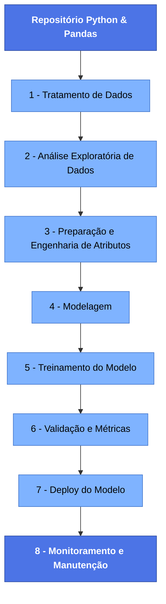

# 📌 Repositório de Python e Pandas

Este repositório contém scripts e exemplos de manipulação de dados utilizando Python e Pandas. O objetivo é fornecer uma base sólida para análise de dados, incluindo limpeza, transformação e visualização.

## 📂 Estrutura do Repositório

- `notebooks/` → Jupyter Notebooks com exemplos práticos.
- `docs/` → Documentação e materiais complementares.

## 🚀 Tecnologias Utilizadas

- 🐍 **Python** → Linguagem principal.
- 📊 **Pandas** → Manipulação e análise de dados.
- 🔢 **NumPy** → Suporte para cálculos numéricos.
- 📈 **Matplotlib & Seaborn** → Visualização de dados.
- 🛠 **Jupyter Notebook** → Execução interativa dos códigos.
- 🛠 **Google Colab Notebook** → Execução interativa dos códigos.

## 📚 Conteúdo

---

### 1️⃣ Tratamento de Dados
- Tratamento de valores nulos e duplicados
- Transformações e limpeza de dados
- Merge, Join e Concatenation de DataFrames

### 2️⃣ Análise Exploratória de Dados
- Estatísticas descritivas com Pandas
- Gráficos com Matplotlib e Seaborn
- Análise exploratória de dados (EDA)

### 3️⃣ Preparação e Engenharia de Atributos (Feature Engineering)
- #### 3.1. Preparação dos dados
  - Normalização / padronização
  - Encoding de variáveis categóricas (One-Hot, Label Encoding)
  - Tratamento mais refinado de outliers
  - Binning de variáveis numéricas (quantis, equal-width)
  - Balanceamento de classes (SMOTE, undersampling)
- #### 3.2. Criação de novas features
  - Atributos derivados (médias móveis, diferenças, razões)
  - Agregações por grupos
  - Features temporais (mês, dia da semana, sazonalidade)
  - Interações entre variáveis (multiplicações, somas, razões)
- #### 3.3. Seleção de features
  - ANOVA, Chi², Mutual Information
  - Importância de features (árvores)
  - PCA, UMAP (redução de dimensionalidade)

### 4️⃣ Modelagem (Machine Learning / Estatística)
- #### 4.1. Escolha dos algoritmos
  - Regressões (Linear, Ridge, Lasso)
  - Classificação (XGBoost, Random Forest, Logistic Regression)
  - Séries temporais (Prophet, ARIMA)
  - Deep Learning (transformers, CNNs, RNNS)
  - Modelos não supervisionados (K-Means, DBSCAN, PCA, Isolation Forest.)

### 5️⃣ Treinamento do Modelo
- Dividir dados (train, validation, test).
- Treinar modelos com métricas adequadas.
- Ajustar hiperparâmetros (GridSearch, Optuna, Bayesian Search, Random Search, Optuna / Hyperopt).
- Tracking de experimentos (MLflow, Weights & Biases).
- Redução de overfitting com regularização e dropout.

### 6️⃣ Validação e Métricas
- #### 6.1 Métricas de exemplo:
  - Classificação: AUC, F1-Score, Precision, Recall
  - Regressão: RMSE, MAE, R²
  - Séries temporais: MAPE, SMAPE
  - Clustering: Silhouette Score
- #### 6.2. Avaliações adicionais:
  - Curvas ROC e PR
  - Matriz de confusão
  - Importância das variáveis
  - Testes de estabilidade (drift)
- #### 6.3. Testes adicionais:
  - Validação cruzada.
  - Teste A/B.
  - Checagem de viés (fairness).
  - Overfitting/underfitting.

### 7️⃣ Deploy do Modelo
- #### 7.1. Formas de deploy:
  - API REST (FastAPI, Flask)
  - Pipeline em nuvem (AWS Lambda, GCP Cloud Run, Azure ML)
  - Deploy em batch (execução programada)
  - Deploy embarcado (apps, dispositivos)

### 8️⃣ Monitoramento e Manutenção
- #### 8.1. Itens monitorados:
  - Data drift (mudança nos dados)
  - Concept drift (mudança nos padrões)
  - Latência
  - Custo de infraestrutura
  - Acertos vs. erros ao longo do tempo
- #### 8.2. Ações:
  - Retreinar o modelo
  - Ajustar pipelines de ETL
  - Revisar features
  - Rodar auditoria de fairness / bias
